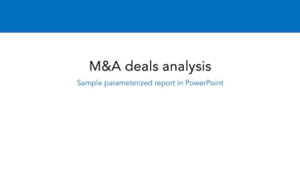

# Automated PowerPoint report

This is a sample analysis of M&A deals per sectors over time.\
The goal is to automate the creation of a .PPT report from a given dataset.\
This project uses R & tidyverse. Rendering is done with [Quarto](https://quarto.org/docs/presentations/powerpoint.html) and Knitr.

> Inspired by a [question](https://github.com/quarto-dev/quarto-cli/discussions/2403) on the quarto-cli repository.\
> Can also can be achieved with a [parameterized quarto report.](https://bookdown.org/yihui/rmarkdown/parameterized-reports.html)

\

{width="465"}
